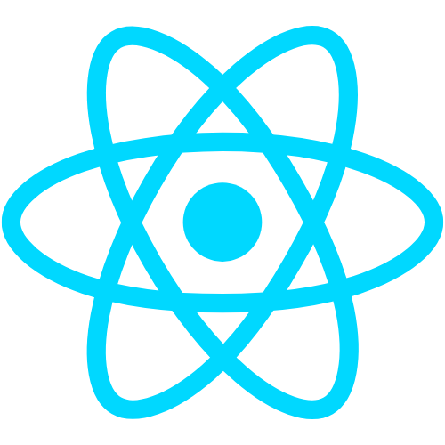
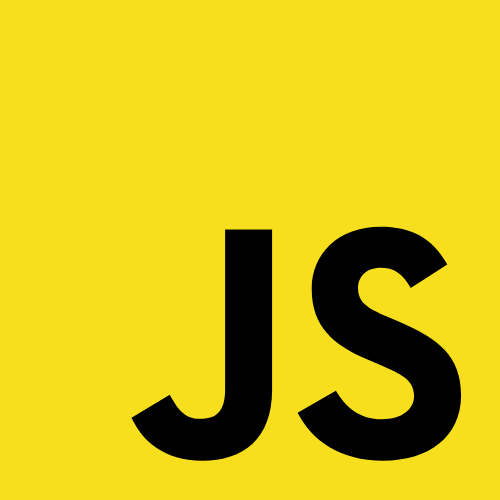
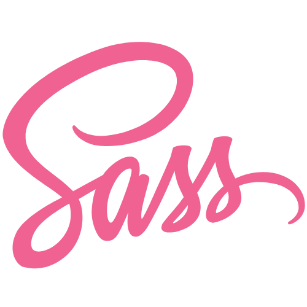
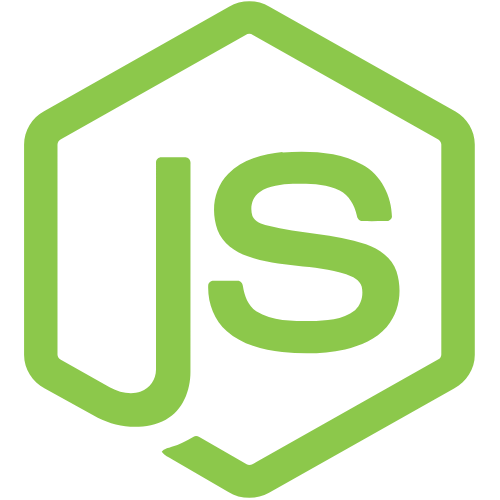
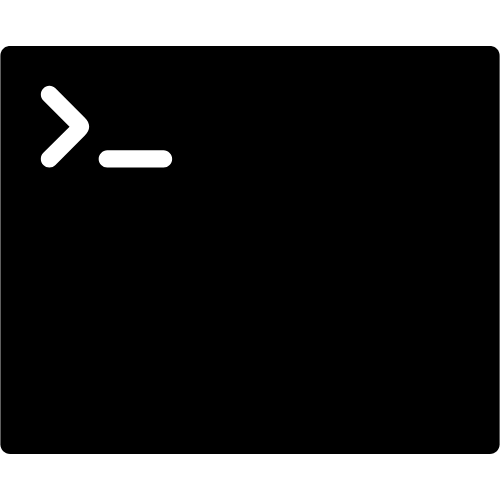
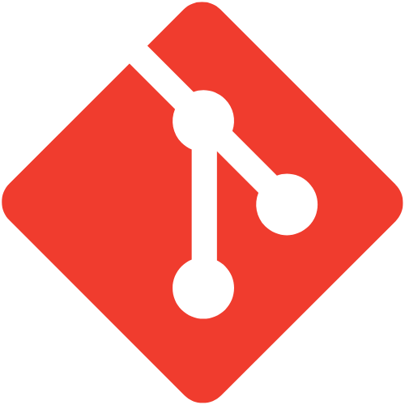
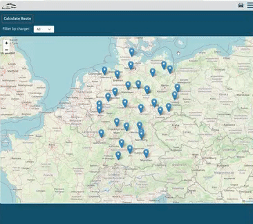
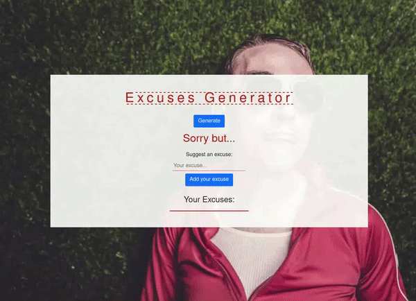

# Hello! 

## I'm Fabio Petrella, a full stack web developer currently living in Berlin.

 
 

Aside from coding, I'm also passionate about music 🎶, art 🎨 and sustainability 🌳.
I am always looking for opportunity to increase my knowledge and at the same time give my contribution.
 
 

### 🔧 Technologies & Tools

 

 
 
 
 

  
:eight_spoked_asterisk: Github Stats

   
  

 

 

  
:eight_spoked_asterisk: Languages Used

   
  

 
 

  
:eight_spoked_asterisk: Some of my Projects

   
   
    EV-connection
     
    
     
     
    SightSpot
     
    
     
     
    Excuse Gen v1
     
    
     
    
  

